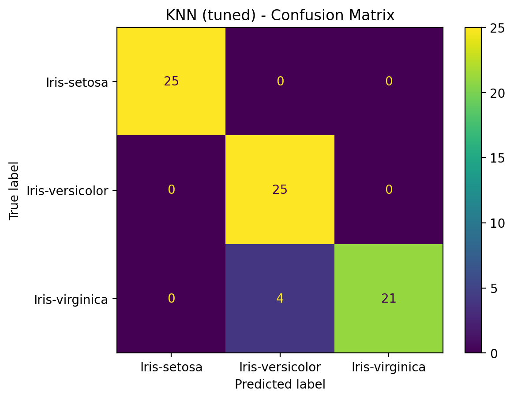
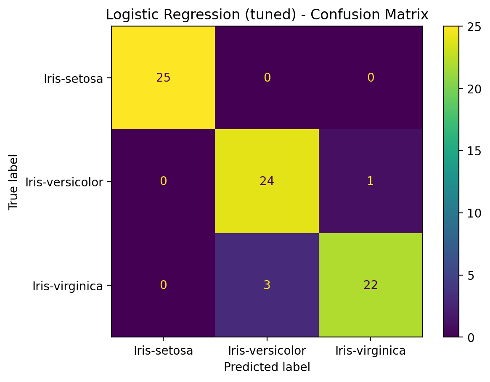
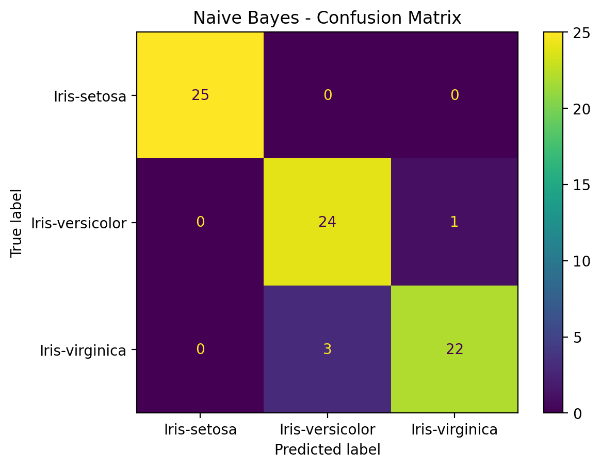
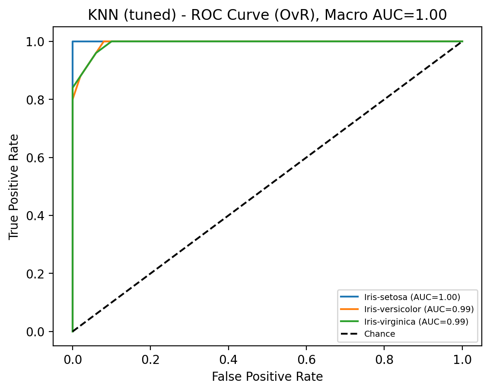
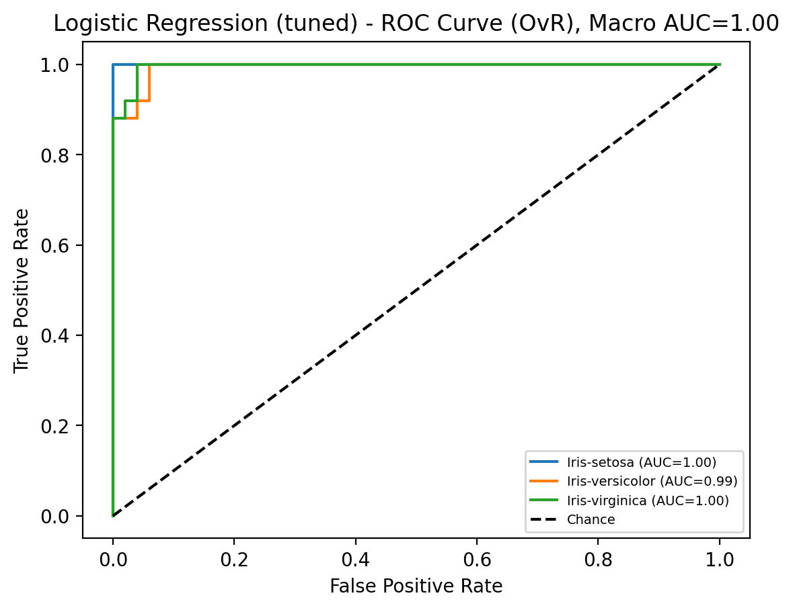

# Iris Species Prediction (KNN vs Logistic Regression vs Naive Bayes)

This project builds a **machine learning classification system** to predict the **species of an Iris flower**
using its sepal and petal measurements.

Models implemented and compared:

* **K-Nearest Neighbors (KNN)** (with hyperparameter tuning)
* **Logistic Regression** (with hyperparameter tuning)
* **Naive Bayes** (GaussianNB baseline)
---

## Dataset

* File: `data/Iris.csv`
* Samples: 150
* Classes: 3 (balanced)
* Features:

  * SepalLengthCm
  * SepalWidthCm
  * PetalLengthCm
  * PetalWidthCm
* Target: `Species` (Iris-setosa, Iris-versicolor, Iris-virginica)

---

## Results (Test Set)

All models performed strongly on the Iris dataset.

| Model | Accuracy | Macro ROC-AUC (OvR) |
|------|----------|----------------------|
| KNN (tuned) | 0.9467 | 0.9955 |
| Logistic Regression (tuned) | 0.9467 | 0.9965 |
| Naive Bayes | 0.9467 | 0.9931 |


✅ **Best ROC-AUC:** Logistic Regression (tuned)
✅ **Accuracy:** All three models achieved the same accuracy on this split.

---

## Plots

### Confusion Matrices

**KNN**


**Logistic Regression**


**Naive Bayes**


### ROC Curves (One-vs-Rest)

**KNN**


**Logistic Regression**


**Naive Bayes**


---

## How to Run

### 1) Clone repository

```bash
git clone https://github.com/Nandd11/iris-species-prediction.git
cd iris-species-prediction

```

### 2) Install dependencies

```bash
pip install -r requirements.txt
```

### 3) Run notebook

```bash
jupyter notebook
```

Open:
`notebooks/iris_classification.ipynb`

---

## Repo Structure

```
iris-species-prediction/
│── notebooks/
│   └── iris_classification_FINAL.ipynb
│── data/
│   └── Iris.csv
│── assets/
│   ├── confusion_matrix_knn.png
│   ├── confusion_matrix_logistic.png
│   ├── confusion_matrix_naive.png
│   ├── roc_curve_knn.png
│   ├── roc_curve_logistic.png
│   └── roc_curve_naive.png
│── requirements.txt
│── .gitignore
└── README.md
```

---

## Author

**Nand**
